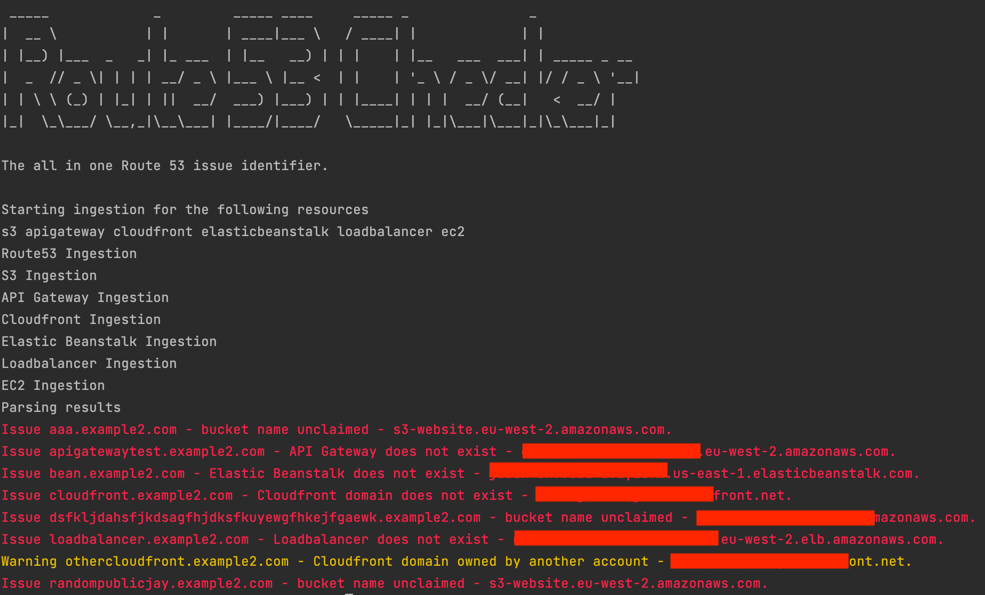

# Route53Checker

Route53Checker identifies possible issues related to an AWS account's Route 53 entries, by reviewing A and CNAME records and comparing them to the resources within the account and public DNS records.

The following are some of the checks conducted.

* Check for possible subdomain takeovers
* Find dangling domains
* Determine if records point to AWS resources outside of account

Route53Checker will iterate through all available regions for services where the API requires a region.

## Usage

To perform all check, including dangling DNS records of non-AWS resources, the following command should be used:

    python3 route53_checker.py -c all -d

Typical output would look like this:

The following switches are available.

|          Switch           | Description                                                                                                                                                                   |
|:-------------------------:|-------------------------------------------------------------------------------------------------------------------------------------------------------------------------------|
|  -c or --checks [checks]  | Checks to be used. These should be comma separated (without a space) and can be any of the following. s3, apigateway, cloudfront, elasticbeanstalk, loadbalancer, ec2, domain |
|      -d or --domain       | Used to include a check for danging resources that are not part of any of the other checks.                                                                                   |
|      -s or --supress      | Used to suppress warnings.                                                                                                                                                    |
| -o or --output [filename] | Save output in JSON format to current working directory.                                                                                                                      |
|       -h or --help        | Displays the help message.                                                                                                                                                    |

## Checks conducted
The following checks can be performed against AWS resources within the account. 

|        Resource        | Check Parameter  | Description                                                                                                                                              |
|:----------------------:|:----------------:|----------------------------------------------------------------------------------------------------------------------------------------------------------|
|           S3           |        s3        | Determines whether a subdomain can be taken over or if a bucket already exists in another account.                                                       |
|   Elastic Beanstalk    | elasticbeanstalk | Determines whether there are any dangling elastic beanstalk records or if they are owned by another account.                                             |
|      API Gateway       |    apigateway    | Compares Route 53 records to both API Gateway V1 and V2. Additional checks are performed to determine whether the resource exists.                       |
|       Cloudfront       |    cloudfront    | Compares Route 53 entries to cloudfront distributions and determines whether the distribution exists and whether it is owned by the current aws account. |
|   AWS Compute (EC2)    |       ec2        | Compares EC2 IPs/Domains to Route 53 records to determine if there are any dangling DNS entries and whether the resource is in the current account.      |
| Elastic Load Balancing |   loadbalancer   | Ingests ALB and ELB data and comapres it to Route 53 entries to determine enter the resource is in the account and whether it exists.                    |

It is also possible to determine whether Route 53 entire within the current account are dangling, using the below. 

|     Switch     | Description                                                                                        |
|:--------------:|----------------------------------------------------------------------------------------------------|
| -d or --domain | Determines whether a CNAME record is dangling. The DNS set on the host the code is run on is used. |
